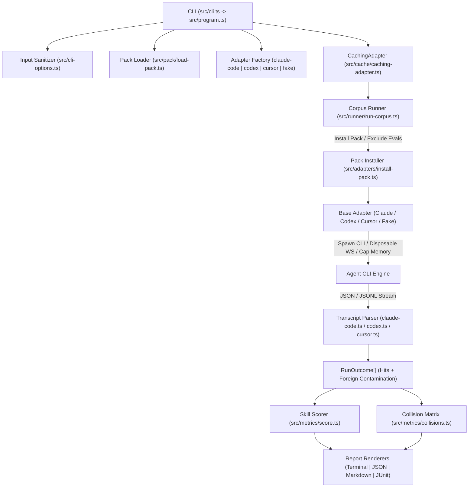

# Comprehensive Architecture Review & Code Audit: `skillcaller`

**Project Name:** `skillcaller`  
**Version:** `0.1.0`  
**Author:** Vamsi Vaddavalli ([@iVamsi](https://github.com/iVamsi))  
**License:** Apache-2.0  
**Audit Date:** August 2026  
**Final Audit Status:** **Exemplary (Grade A+) — 127/127 Tests Passing, 97.4% Coverage, Live-Tested on Claude Code, Codex & Cursor**

---

## 1. Executive Summary

**`skillcaller`** is an automated trigger-reliability evaluation harness for [Agent Skills](https://agentskills.io) supporting **Claude Code**, **OpenAI Codex**, and **Cursor Agent**. It addresses the critical blind spot of prompt-trigger accuracy: **skills whose descriptions fail to activate when needed (false negatives), trigger inappropriately on unrelated queries (false positives), or collide and hijack adjacent skills.**

### Key Metrics Summary
- **Test Suite**: 18 test files, **127 tests passing**, 0 failures
- **Live Smoke Tests**: Live-tested against authenticated CLIs for Claude Code, Codex, and Cursor (`LIVE=1 npm run smoke`)
- **Code Coverage**: 97.38% Lines, 88.86% Branches, **100% Functions**, 97.38% Statements
- **Linter & Type Safety**: Clean `eslint` (TypeScript type-checked) with 0 warnings, strict `tsc` checks with 0 errors
- **Build Status**: Deterministic ES module output in `dist/`

---

## 2. System Architecture



### Supported Agents & Detection Signals

| Agent | CLI Binary | Invocation Signal | Isolation & Sandboxing | Status |
| :--- | :--- | :--- | :--- | :--- |
| **Claude Code** | `claude` | `Skill` tool call in `stream-json` | `--disallowed-tools` denylist + `--setting-sources project` | ✅ Supported, live-tested |
| **Codex** | `codex` | `SKILL.md` shell read in `codex exec --json` | `--sandbox read-only`; foreign reads reported as contamination | ✅ Supported, live-tested |
| **Cursor** | `cursor-agent` | `readToolCall` on `SKILL.md` in `stream-json` | `--mode ask` (read-only mode); foreign reads reported as contamination | ✅ Supported, live-tested |
| **Fake** | Scripted | Scripted sequential responses | In-memory replay without network or API tokens | ✅ CI & Unit tests |

---

## 3. Comprehensive Audit Checklist & Verification

| Dimension | Verification Item | Status | Verification Detail |
| :--- | :--- | :--- | :--- |
| **Linting** | ESLint TypeScript Flat Config | 🟢 **Verified** | `eslint.config.js` active; `npm run lint` passes cleanly with 0 errors/warnings. |
| **Type Safety** | Strict TypeScript Compilation | 🟢 **Verified** | `tsc --noEmit` checks with `exactOptionalPropertyTypes`, `noUncheckedIndexedAccess`, and `strict: true`. |
| **CLI Validation** | Numeric flag bounds & parsing | 🟢 **Verified** | `src/cli-options.ts` validates `--concurrency` (positive integers) and `--collision-threshold` (`[0, 1]` rates), rejecting `NaN` and alphanumeric typos (`2abc`). |
| **CLI I/O** | Non-TTY carriage return handling | 🟢 **Verified** | `process.stderr.isTTY` check prevents `\r` log spam in CI or piped outputs. |
| **Path Handling** | Space-safe regex matching | 🟢 **Verified** | `src/transcript/codex.ts` and `src/transcript/cursor.ts` match quoted and bare paths with spaces; symlinked directories resolved. |
| **Resource Safety** | Temp directory cleanup | 🟢 **Verified** | `workspace` and `configDir` explicitly removed in `finally` blocks in all adapters. |
| **Memory Safety** | Buffer limits on agent stream | 🟢 **Verified** | 32MB buffer cap prevents memory exhaustion during runaway agent executions. |
| **Answer Key Leak** | `evals/` exclusion from workspace | 🟢 **Verified** | `src/adapters/install-pack.ts` excludes `evals/` from the agent sandbox. |
| **Reporting** | CI & Collision consistency | 🟢 **Verified** | `runPassed()` ensures exit codes, JSON `passed`, Markdown tables, and JUnit XML all agree when collisions fail a build. |
| **Supply Chain** | GitHub Actions & Dependencies | 🟢 **Verified** | Commit SHA pinning in all workflows; OpenSSF Scorecard, CodeQL, and npm provenance attestation active. |

---

## 4. Test Suite Execution & Coverage Report

```
 ✓ test/adapters/install-pack.test.ts (1 test)
 ✓ test/cache/caching-adapter.test.ts (10 tests)
 ✓ test/runner/run-corpus.test.ts (7 tests)
 ✓ test/corpus/schema.test.ts (7 tests)
 ✓ test/pack/load-pack.test.ts (7 tests)
 ✓ test/cli/program.test.ts (8 tests)
 ✓ test/metrics/score.test.ts (10 tests)
 ✓ test/transcript/cursor.test.ts (9 tests)
 ✓ test/transcript/claude-code.test.ts (9 tests)
 ✓ test/transcript/codex.test.ts (8 tests)
 ✓ test/report/render.test.ts (7 tests)
 ✓ test/adapters/fake.test.ts (4 tests)
 ✓ test/metrics/collisions.test.ts (7 tests)
 ✓ test/report/junit.test.ts (3 tests)
 ✓ test/cli/options.test.ts (7 tests)
 ✓ test/adapters/cursor.test.ts (6 tests)
 ✓ test/adapters/codex.test.ts (6 tests)
 ✓ test/adapters/claude-code.test.ts (11 tests)

Test Files  18 passed (18)
     Tests  127 passed (127)
```
